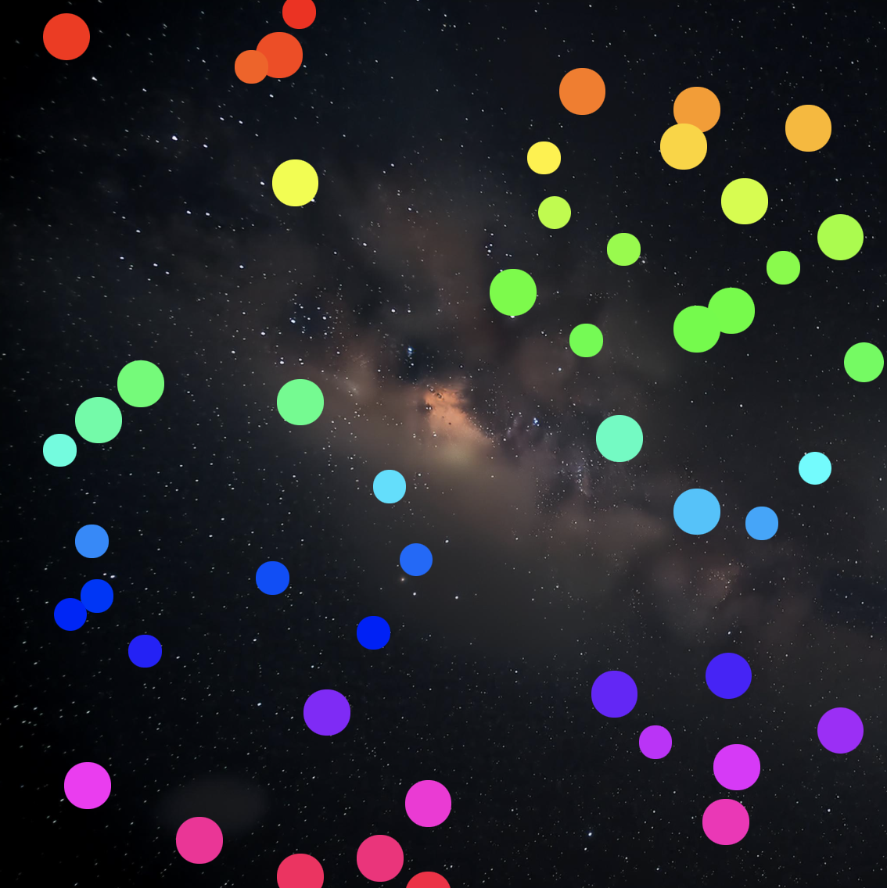

# Project for MIT xPro Full Stack Developer course

## Flowing Particles

This project demonstrates how to create animated particles in JavaScript that rotate in a loop.

## Functionality

- Particles rotate from the left to right.
- When they hit the walls, they change in size.

## Files

- `one-dimension-motion.html`: Main HTML file that includes the canvas and scripts.
- `one-dimension-motion.js`: Contains functions to create and manipulate the particle elements and its effects.

## How to run

1. Clone the repository.
2. Open one-dimension-motion.html in a web browser.
3. Preview: <a href="https://ceciliosanchez.com/github/xpro/moving_particles/one-dimension-motion.html" target="_blank">Flowing Particles</a>

## Support

Reach out at http://ceciliosanchez.com/contact/

## License

This project is licensed under the MIT License.

